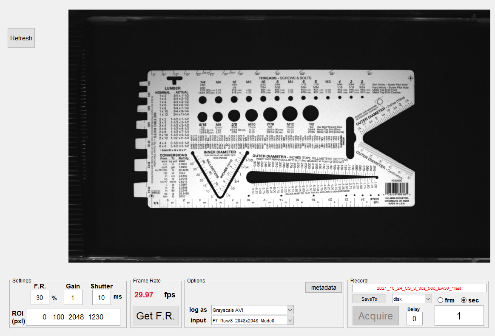

# Grasshopper

Grasshopper is a MATLAB GUI that controls FLIR (formerly Point Grey) cameras, specifically Grasshopper GS3-U3-41C6NIR-C.

Grasshopper will remember the last used settings. You do not need to enter your settings each time you start the camera.


# Usage 

```matlab
% Start GUI
Grasshopper
```
A GUI (see picture above) will be initiated with images streaming realtime.


# Dependency 

Grasshopper depends on the MATLAB wrapper developed by FLIR.  FLIR camera software and MATLAB adaptor has to be installed prior to starting Grasshopper. 

When a new video (or image) name is entered into the Record module, Grasshopper will call another GUI (MetaGui) to collect metadata and also to allow user to take notes related to the current recording, which all be saved as a separate file.


# Settings

**F.R:** Frame Rate. Type any number between 1 and max allowed frame rate. Camera will be set to return specifies frames per second.

**Gain:** Gain (1-10)

**Shutter:** Exposure time (milliseconds, ms)

**ROI (pxl):** Region of Interest setting. [Width_Offset Height_Offset Width Height] (units in pixels)


# Frame Rate

**GET F.R:** When pressed, Grasshopper will request a number of frames (3x F.R.) from camera and calculate the camera frame rate using the total elapsed time and total number of frames requested. (FrameRate = 1/mean(diff(timeStamp)), timeStamp: a list of time points for each acquired frame)


# Options

**log as:** Drop down menu. Select the type of the video (or image) you want to record. Following types are available.

Motion JPEG 2000, Archival, Motion JPEG AVI, Uncompressed AVI, MPEG-4, Grayscale AVI, mat file, tiff

**Input:** Drop down menu. Select the input type of the acquired image. This list is camera specific. 

**metadata:** When pressed, calls gui (metaGUI) which allows user defined meta data collection and note keeping. 


# Record

**save to:** Press to select where the file will be recorded in your PC and to define the file name. Default recording location is C\Data. Grasshopper will create a folder and set the folder name to date of recording (i.e. 2021\01\01). File name can be edited directly on the text editor (topmost text edit box). Grasshopper will disable the text editing when a video is recorded to eliminate writing over the same file.

**save location option:** Drop down menu. Select saving location option. Disc, memory, and disc&memory are available

**frm or sec:** Select to acquire certain number of frames, or record for a defined time

**delay:** When pressed, calls gui (metaGUI) which allows user defined meta data collection and note keeping. 

**Acquire:** Starts recording images in the format defined by **log as** for the duration defined by the time or number of frames (bottom-right text editor under Record console). Output file is saved with the name defined by **save to** or the text editor (topmost panel under Record)


